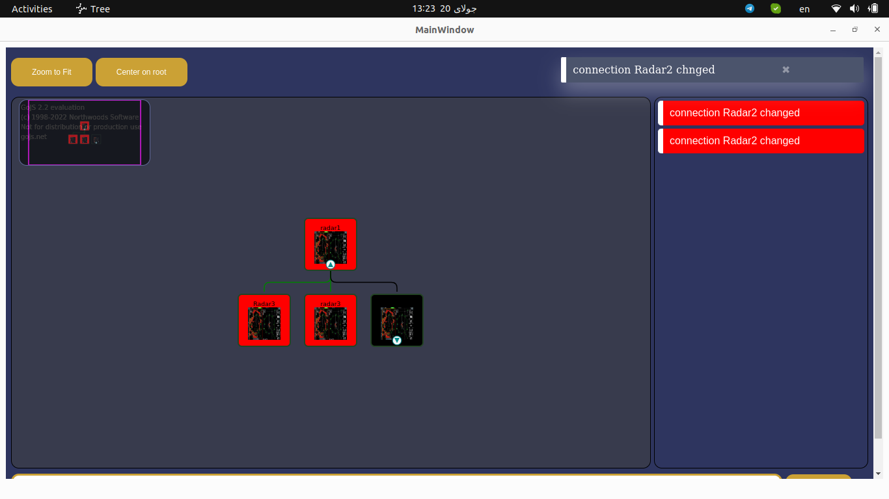

# tree Json 
this tree was created in QT by JavaScript
- In this project, we received data via cpp in json format and gave it to Js using Qml
## Tree 
 for create this tree used [Go](https://gojs.net/latest/index.html) Library 
 

